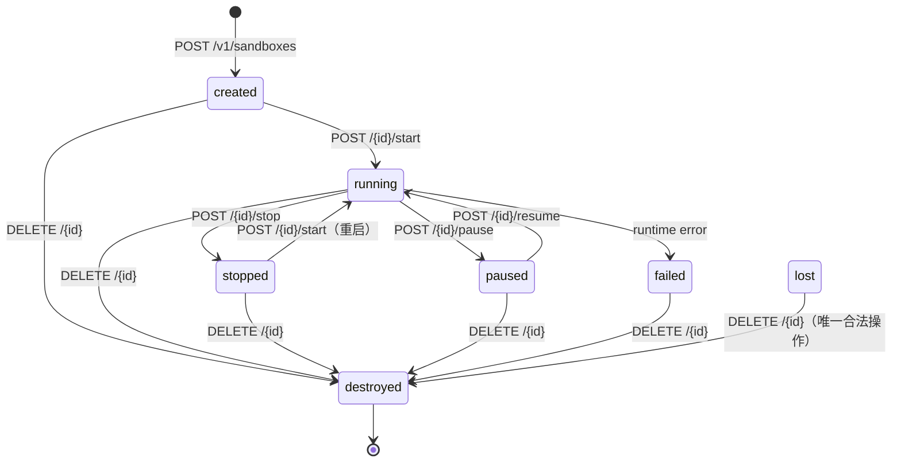

# Sandbox 生命周期

每个 sandbox 在其存在期间会经历一系列状态转换。理解这些状态有助于正确设计 agent 工作流程和错误处理逻辑。

## 状态一览

| 状态 | 含义 |
|---|---|
| `created` | sandbox 已创建，OCI bundle 准备就绪，进程尚未启动 |
| `running` | 进程正在运行中 |
| `stopped` | 进程已退出（自然退出或被 stop），但 sandbox 数据保留 |
| `paused` | 进程被冻结（cgroup freezer / SIGSTOP），内存/fd/socket 状态全部保留 |
| `destroyed` | sandbox 已彻底销毁，所有资源已释放 |
| `failed` | sandbox 进入不可恢复的错误状态 |
| `lost` | sandbox 元数据存在，但运行态已失联（通常因 worker 重启） |

## 状态机图



## 各状态详解

### `created`

sandbox 刚被创建：
- OCI bundle 已准备好（overlayfs 挂载完成）
- 进程**尚未启动**
- workspace 目录已初始化
- 网络命名空间已分配（runc 模式）

此时可以：
- 通过 FS API 写入初始文件
- 调用 `start` 启动进程
- 直接 `delete` 清理（不需要先 stop）

### `running`

进程已启动，sandbox 完全运行中：
- 可以执行命令（`exec`）
- 可以启动长驻进程（`processes`）
- PTY 可以连接
- browser 可以启动

**IdleTimeout**（如果配置了）：sandbox 在 `running` 状态下无操作达到阈值后，会**自动 pause**（而不是 stop）。这样 resume 时可以毫秒级恢复，而不是重启进程。

### `stopped`

进程已退出：
- 文件系统数据**仍然保留**（与 destroyed 的本质区别）
- 可以重新 `start`（重启进程，文件系统上次的修改保留）
- 与 `paused` 的区别：stopped 进程已死，重启需要 spawn 新进程，会丢失 shell scrollback

### `paused`

进程被冻结，**不等于停止**：
- 进程仍然存活（PID 未变），只是被 SIGSTOP / cgroup freezer 挂起
- 内存、fd、打开的 socket 全部原样保留
- `resume` 后毫秒级继续执行，shell scrollback 不丢失
- PTY 连接会断开（客户端需要重连），但 bash 历史 / 未提交的命令保留

::: tip pause vs stop
- 用 `pause` 做"暂时闲置"：resume 后状态 100% 恢复，适合 idle timeout 触发
- 用 `stop` 做"真正停止"：适合需要明确"结束本次运行"的场景
:::

### `destroyed`

sandbox 已被彻底清除：
- 所有进程已 kill
- OCI bundle 已删除
- workspace volume 已释放
- 网络命名空间已销毁
- 数据库记录标记为 `destroyed`（历史查询用）

::: warning 不可逆操作
`destroyed` 是终态，**无法恢复**。所有文件和运行状态永久丢失。
:::

### `failed`

sandbox 遭遇不可恢复的运行时错误（如 runc 崩溃、cgroup 操作失败）：
- 唯一合法操作是 `DELETE`（销毁清理）
- worker 会在日志中记录失败原因

### `lost`

sandbox 元数据存在，但 worker 重启后失去了对进程的追踪：
- 原因：worker 进程退出后，localprocess / runc 子进程也随之终止
- **只能** `DELETE`（不能 start / resume）
- worker 重启后会自动 reconcile：能找回的 sandbox 恢复为 `running`，找不回的标记为 `lost`

## 状态转换规则

### 合法转换

```
created  → running   (start)
created  → destroyed (delete)

running  → stopped   (stop)
running  → paused    (pause)
running  → destroyed (delete)
running  → failed    (runtime error)

stopped  → running   (start, 重启)
stopped  → destroyed (delete)

paused   → running   (resume)
paused   → destroyed (delete)

failed   → destroyed (delete)
lost     → destroyed (delete)
```

### 非法转换

尝试非法转换会返回 `409 Conflict`，错误信息为 `sandbox: invalid state transition`。

例如：
- 对 `created` sandbox 调用 `stop` → `409`
- 对 `destroyed` sandbox 调用 `start` → `404`（sandbox 已删除）
- 对 `lost` sandbox 调用 `resume` → `409`

## 生命周期策略

创建 sandbox 时可以配置自动生命周期策略：

```json
{
  "idle_timeout_seconds": 300,
  "ttl_seconds": 3600
}
```

| 字段 | 默认值 | 含义 |
|---|---|---|
| `idle_timeout_seconds` | 0（禁用） | sandbox 在 `running` 状态下无操作 N 秒后自动 pause |
| `ttl_seconds` | 0（禁用） | sandbox 创建后 N 秒后自动 destroy（无论状态） |

::: tip 推荐配置
对于 AI agent 工作流，推荐设置 `idle_timeout_seconds: 300`（5 分钟）。agent 不活跃时自动 pause 节省资源，需要时 resume 恢复，无感知延迟。
:::

## 并发操作

sandbox API 使用状态机锁防止并发冲突。如果两个请求同时尝试修改同一 sandbox 状态，后来的请求会收到 `409 Conflict`。建议 agent 实现串行状态操作，或处理好 409 重试逻辑。

## 与 Process 的关系

sandbox 有自己的状态机，sandbox 内的 **Process** 也有独立状态（`running` / `exited` / `killed` / `failed`）：

- sandbox `stop` 会 kill 所有 Process
- sandbox `pause` 会冻结所有 Process
- 单个 Process 退出不影响 sandbox 状态
- sandbox `destroyed` 会强制清理所有 Process

详见 [Processes API 参考](/api/processes)。
